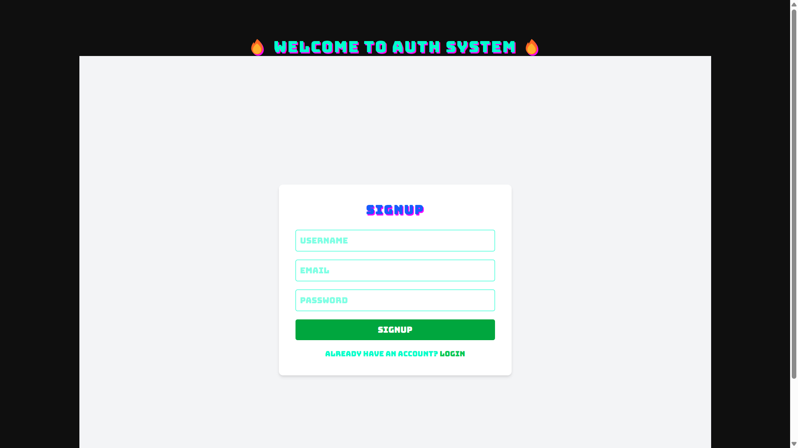
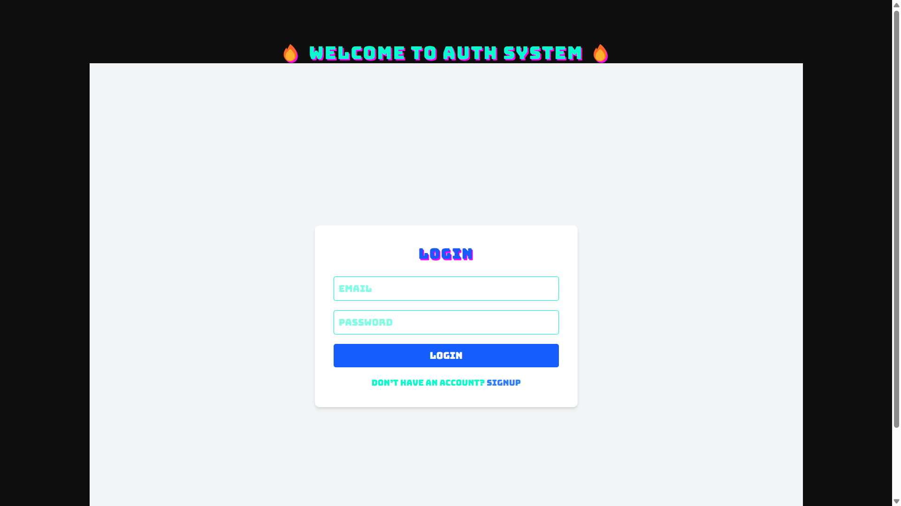
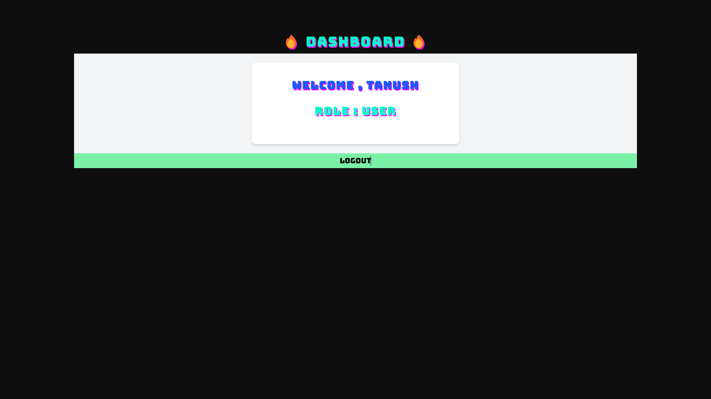

# -Authentication-System-Full-Stack-
AuthSystem is a full-stack authentication system built using React, Node.js, Express, and Redis, implementing modern and secure practices like JWT-based access/refresh tokens, interceptors, private routes, and token blacklisting. The system ensures safe login, logout, session handling, and protected routes for users.
# 🛡️ AuthSystem - Secure JWT Authentication App

## 🚀 Features
- 🔐 Secure Login & Signup
- ⚙️ JWT Access & Refresh Tokens
- 🍪 HTTP-Only Cookie-based Auth
- ♻️ Auto Token Refresh with Axios Interceptors
- 🔒 Protected Routes (`/me`)
- 🧠 Redis-based Refresh Token Blacklisting (Logout)
- 🎮 Cool Gaming Font UI
- ✅ PrivateRoute Component in React
- ❌ 401 Handler + Retry Failed Requests Automatically

---

## 🧑‍💻 Tech Stack

### Frontend  
- React  
- Axios  
- Tailwind CSS

### Backend  
- Node.js  
- Express  
- MongoDB  
- Redis  
- JWT  

---

## 📸 Screenshots

| Signup Page | Login Page | Dashboard |
|-------------|------------|-----------|
|  |  |  |

---

## 📦 Installation

### 🖥️ Backend

```bash
cd server
npm install
npm run dev
